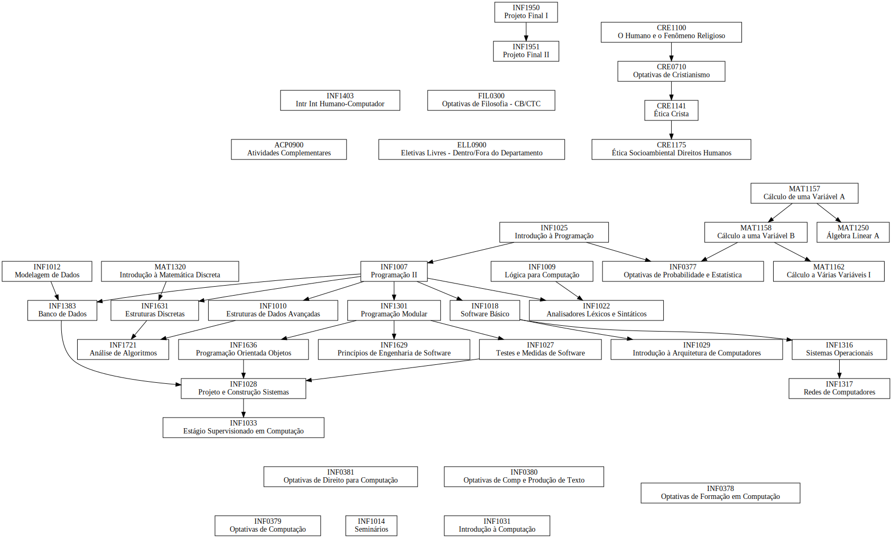

# Grafos de disciplinas da PUC-Rio

Esse repositório contém grafos dos currículos do curso de Ciência da Computação da PUC-Rio.

Inicialmente feitos para eu me organizar e planejar quais disciplinas cursar, decidi compartilhar para que outros alunos possam se beneficiar.

Pull Requests com outros currículos e melhorias são muito bem-vindos :)

## Motivação

Só se avança no curso se você cursar pré-requisitos: se você existe uma disciplina obrigatória que possui um pré-requisito que possui um pré-requisito que possui um pré-requisito que você não cursou, não importa quantas outras matérias que você faça, você não vai se formar em menos de 4 semestres. *Cada semestre em que você não cursa esse último pré-requisito aumenta a sua expectativa de formatura em mais um semestre.*

Além disso, é útil tentar "desbloquear" o máximo possível de disciplinas para você ter mais alternativas no período de matrícula. Isso é especialmente importante ao final do curso, em que você precisa ter mais flexibilidade com os horários da faculdade para ter tempo de estagiar.

## [Ciência da Computação](ccp)

### Currículo 1

#### Organizado por pré-requisitos

<small>Clique direito » Abrir imagem em uma nova guia</small>

#### Organizado por período

<small>Clique direito » Abrir imagem em uma nova guia</small>

](ccp/curriculo-1-por-periodo.svg)

