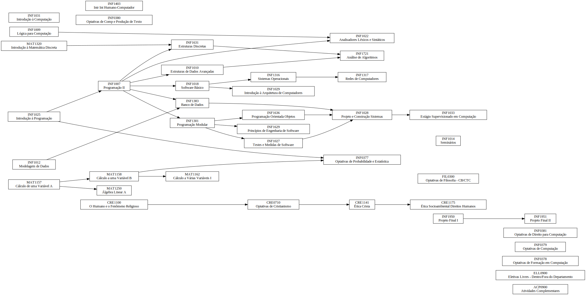

# Grafos de disciplinas da PUC-Rio

Esse repositório contém grafos das disciplinas do curso de Ciência da Computação da PUC-Rio.

## Ciência da Computação

### Currículo 0

#### Organizado por dependências

#### Organizado por período

