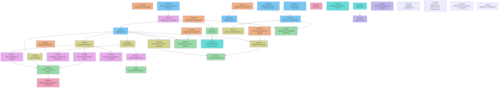

```mermaid
flowchart TD
    %%{init:{'flowchart':{'rankSpacing': 50}}}%%
    INF1025[INF1025<br/>Introdução à Programação]:::periodo1
    INF1012[INF1012<br/>Modelagem de Dados]:::periodo1
    INF1009[INF1009<br/>Lógica para Computação]:::periodo1
    INF1031[INF1031<br/>Introdução à Computação]:::periodo1
    MAT1157[MAT1157<br/>Cálculo de uma Variável A]:::periodo1
    MAT1320[MAT1320<br/>Introdução à Matemática Discreta]:::periodo1
    CRE1100[CRE1100<br/>O Humano e o Fenômeno Religioso]:::periodo2
    INF0380[INF0380<br/>Optativas de Comp e Produção de Texto]:::periodo2
    INF1403[INF1403<br/>Intr Int Humano -Computador]:::periodo2
    INF1007[INF1007<br/>Programação II]:::periodo2
    MAT1158[MAT1158<br/>Cálculo a uma Variável B]:::periodo2
    MAT1250[MAT1250<br/>Álgebra Linear A]:::periodo2
    INF1383[INF1383<br/>Banco de Dados]:::periodo3
    INF1631[INF1631<br/>Estruturas Discretas]:::periodo3
    INF1010[INF1010<br/>Estruturas de Dados Avançadas]:::periodo3
    INF1301[INF1301<br/>Programação Modular]:::periodo3
    INF1018[INF1018<br/>Software Básico]:::periodo3
    MAT1162[MAT1162<br/>Cálculo a Várias Variáveis I]:::periodo3
    CRE0710[CRE0710<br/>Optativas de Cristianismo]:::periodo4
    INF1027[INF1027<br/>Testes e Medidas de Software]:::periodo4
    INF1029[INF1029<br/>Introdução à Arquitetura de Computadores]:::periodo4
    INF1316[INF1316<br/>Sistemas Operacionais]:::periodo4
    INF1629[INF1629<br/>Princípios de Engenharia de Software]:::periodo4
    INF1636[INF1636<br/>Programação Orientada Objetos]:::periodo4
    CRE1141[CRE1141<br/>Ética Crista]:::periodo5
    INF0377[INF0377<br/>Optativas de Probabilidade e Estatística]:::periodo5
    INF1022[INF1022<br/>Analisadores Léxicos e Sintáticos]:::periodo5
    INF1028[INF1028<br/>Projeto e Construção Sistemas]:::periodo5
    INF1317[INF1317<br/>Redes de Computadores]:::periodo5
    INF1721[INF1721<br/>Análise de Algoritmos]:::periodo5
    INF1014[INF1014<br/>Seminários]:::periodo6
    INF1033[INF1033<br/>Estágio Supervisionado em Computação]:::periodo6
    CRE1175[CRE1175<br/>Ética Socioambiental Direitos Humanos]:::periodo7
    FIL0300[FIL0300<br/>Optativas de Filosofia - CB/CTC]:::periodo7
    INF1950[INF1950<br/>Projeto Final I]:::periodo7
    INF0381[INF0381<br/>Optativas de Direito para Computação]:::periodo8
    INF1951[INF1951<br/>Projeto Final II]:::periodo8
    ACP0900[ACP0900<br/>Atividades Complementares]:::semperiodo
    ELL0900[ELL0900<br/>Eletivas Livres - Dentro/Fora do Departamento]:::semperiodo
    INF0378[INF0378<br/>Optativas de Formação em Computação]:::semperiodo
    INF0379[INF0379<br/>Optativas de Computação]:::semperiodo

    INF1025 --> INF1007
    MAT1157 --> MAT1158
    MAT1157 --> MAT1250
    INF1007 & INF1012 --> INF1383
    INF1007 & MAT1320 --> INF1631
    INF1007 --> INF1010
    INF1007 --> INF1301
    INF1007 --> INF1018
    MAT1158 --> MAT1162
    CRE1100 --> CRE0710
    INF1301 --> INF1027
    INF1018 --> INF1029
    INF1018 --> INF1316
    INF1301 --> INF1629
    INF1301 --> INF1636
    CRE0710 --> CRE1141
    INF1025 & MAT1158 --> INF0377
    INF1007 & INF1009 --> INF1022
    INF1027 & INF1383 & INF1636 --> INF1028
    INF1316 --> INF1317
    INF1010 & INF1631 --> INF1721
    INF1028 --> INF1033
    CRE1141 --> CRE1175
    INF1950 --> INF1951

    classDef periodo1 fill:#edaf83
    classDef periodo2 fill:#77c6f1
    classDef periodo3 fill:#d1d38c
    classDef periodo4 fill:#e8abea
    classDef periodo5 fill:#99dba7
    classDef periodo6 fill:#f19fb7
    classDef periodo7 fill:#64dcd8
    classDef periodo8 fill:#c0b4ed
```